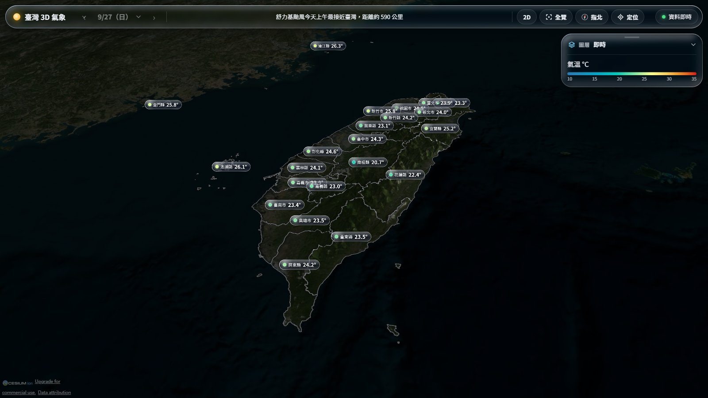
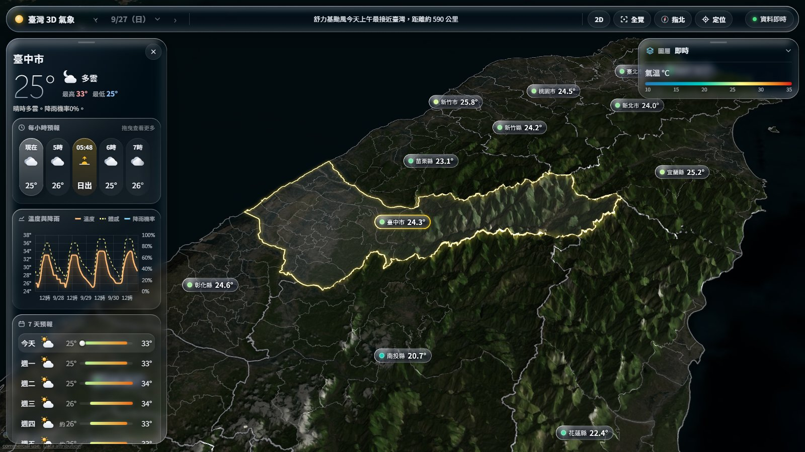

# 臺灣 3D 氣象

**正式網址：<https://weather3d-theta.vercel.app/>**

以 3D 地形呈現臺灣 22 縣市、368 鄉鎮的即時觀測與天氣預報。首頁是可旋轉的 3D 臺灣，太陽與月亮依真實時間出現在天空中；點擊任一縣市，左側會出現一張玻璃卡片，顯示該地的即時天氣、逐時預報與溫度降雨曲線、一週預報，以及風、氣壓、紫外線、日出日落和月相。





資料來自[中央氣象署開放資料平臺](https://opendata.cwa.gov.tw/)，每 10 分鐘自動更新，存放在 SQLite（正式環境使用 Turso 託管的 libSQL）。

```text
CWA API → requests → JSON 解析 → SQLite / Turso → Flask → CesiumJS + ECharts → Vercel
```

## 功能

- **3D 臺灣**：Cesium World Terrain 地形（高度放大 2.5 倍），每個縣市立著一張玻璃立牌，顯示縣市名與數值；立牌是 3D 場景的一部分，近的擋住遠的、遠的變小。頂欄可切換預報日期，另有 2D／3D、全覽、指北、定位
- **縣市邊界**：以影像方式鋪在地形上，放大的山脈不會遮住邊界；選取的縣市沿山脊發光
- **圖層，一次一個**：
  - 氣溫與降雨：即時氣溫／預報最高／預報最低／降雨機率
  - 空氣品質：環境部測站 AQI（沒有金鑰時改用 Open-Meteo 的模式估計）
  - 風場：Open-Meteo 地面 10 公尺風，以流動的粒子呈現，在畫面邊緣與近景淡出
  - 颱風：過去路徑、預報路徑與 70% 機率潛勢錐、七級風暴風圈，颱風眼上方疊上向日葵 9 號的真實紅外線雲圖（NASA GIBS）；颱風卡以時間軸走過路徑
- **縣市卡片**：即時溫度與今日高低溫；可拖曳的逐時預報（含日出日落）；溫度、體感溫度與降雨機率曲線；一週預報；體感、濕度、風（指南針）、氣壓（儀表）、降雨量、紫外線、太陽軌跡、月相
- **鄉鎮界線與鄉鎮卡片**：拉近後顯示 368 個鄉鎮的界線；滑鼠移上去看鄉鎮預報，點擊後在縣市卡片下方出現鄉鎮卡片，整合鄉鎮預報、熱傷害指數、鄉鎮內雨量站的最大雨量、氣象站的溫度範圍／濕度／陣風、紫外線（鄉鎮內沒有測站時借用同縣市最近的測站），鄉鎮內的測站名稱標在地圖上。網址 `/?region=臺北市&town=大安區` 可直接分享
- **浮動卡片**：天氣卡片在左、圖層控制在右、颱風卡在中間；抓住把手可拖曳，放開後吸附到最近的邊，雙擊歸位；卡片互不重疊，縣市與鄉鎮卡片一次只展開一張，放著不動會自動收合
- **天氣提醒跑馬燈**：頂欄輪播氣象署警特報（大雨、低溫、高溫、強風、濃霧、颱風…），以及從預報與即時觀測推導的提醒（雷雨、高溫、強風、陣風、紫外線、空品、颱風最接近時間）；點擊飛到該處
- **建築模型與陰影模擬**：Google 實景 3D（Photorealistic 3D Tiles，經 Cesium ion），依太陽高度調整清晨、黃昏、夜晚的光線，並依最近測站的天氣變灰或起霧；按播放鍵就在目前的地點從早上開始播放一天的日照，建築陰影隨太陽移動（鏡頭太高時先降到畫面中央）。四個按鍵飛到臺北 101、新板特區、桃園藝文特區、中興大學（Google 在臺灣只有雙北、桃園、臺中有實景 3D）。拉近時地形自動回到真實比例，讓建築貼合地面
- **太陽與月亮**：依目前時間計算的日照明暗；開啟建築模型時，頂欄換成日照時間軸，可拖曳模擬一天的日照變化
- **獨立頁面**：`/region?name=臺中市` 可直接分享
- **自動更新**：觀測每 10 分鐘、預報每小時檢查；頁面每 3 分鐘自動取得新資料，不需重新整理
- **資料時效提示**：頁首顯示觀測與預報時間，延遲或過期時變色警示

## 架構

```text
cron-job.org ──► /api/cron/observations  每 10 分鐘
             ──► /api/cron/forecasts     每 1 小時
Vercel Cron  ──► /api/cron/daily         每天 00:30（台北時間）
                        │
                        ▼  etl/：抓取 → 解析 → 驗證 → 在同一個 transaction 寫入
                  Turso（libSQL）
                        │
                        ▼  app/queries.py
      Flask on Vercel ── 頁面（Jinja）＋ JSON API（edge 快取 60 秒）
                        │
                        ▼
      瀏覽器：CesiumJS 3D 地球 ─ 點擊縣市 ─► 面板（ECharts）
```

| 目錄 | 內容 |
|---|---|
| `app/` | Flask app、設定、資料庫介面（本機 SQLite 或 Turso HTTP）、查詢、路由 |
| `etl/` | CWA client、四類資料的 parser、每日最高／最低計算、縣市彙總、排程 job |
| `db/schema.sql` | 資料表定義，本機與 Turso 共用 |
| `public/static/` | 前端 JS、CSS、縣市邊界 GeoJSON（由 Vercel CDN 直接提供） |
| `scripts/` | 初始化資料庫、手動執行 job、抓 sample、產生縣市邊界 |
| `notebooks/explore.ipynb` | 用 pandas 探索 JSON 結構與資料庫內容 |
| `tests/` | pytest，使用真實 CWA sample 與暫存 SQLite |
| `docs/` | README 的畫面截圖（不部署） |

### 資料庫

| 資料表 | 內容 |
|---|---|
| `TemperatureForecasts` | 每一版預報的每日最低（`mint`）、最高（`maxt`）、降雨機率、天氣，沿用課程命名 |
| `LatestTemperatureForecasts`（view） | 每個縣市、每一天最新一版的預報，首頁預設讀這個 |
| `ForecastRuns` | 每一版預報。CWA 預報沒有發布時間欄位，所以用內容雜湊判斷是否為新版本 |
| `HourlyForecasts`／`PeriodForecasts` | 3 天逐時與一週 12 小時預報原始時段（保留 90 天） |
| `Stations`／`Observations` | 363 個測站與每 10 分鐘的觀測（原始資料保留 30 天） |
| `CountyObservations` | 每 10 分鐘的縣市彙總值，供地圖與縣市面板使用 |
| `DailyObserved` | 每日實測最高、最低、平均（永久保存） |
| `AstroDaily` | 日出日落、月出月落 |
| `JobStatus`／`Locks` | 排程狀態與防止重複執行的鎖 |

所有寫入都是冪等的：同一筆資料重複寫入不會增加筆數，CWA 或資料驗證失敗時整批不寫入，舊資料保持不變。

## 資料來源與計算方式

| 資料集 | 用途 |
|---|---|
| `O-A0003-001` 自動氣象站觀測 | 即時資料、實測趨勢、每日實測最高／最低 |
| `F-D0047-089` 縣市 3 天預報 | 逐時溫度、體感、濕度、降雨機率 |
| `F-D0047-091` 縣市一週預報 | 一週最高／最低、天氣、降雨機率 |
| `A-B0062-001`／`A-B0063-001` | 日出日沒、月出月沒 |
| `O-A0002-001` 雨量站 | 雨量圖層（10 分鐘至 3 天累積） |
| `O-A0001-001` 逐時觀測 | 氣象站圖層（含陣風、當日高低溫） |
| `W-C0034-005` 颱風 | 颱風路徑、預報與 70% 機率半徑 |
| `M-A0085-001` 熱傷害指數 | 各鄉鎮目前指數與 24 小時內最高值 |
| `O-A0005-001` 紫外線 | 測站當日最大值 |
| `F-D0047-093` 鄉鎮預報 | 368 鄉鎮逐時溫度、天氣、降雨機率（一次最多 5 縣市，分批取得） |
| `W-C0033-001`／`-003`／`-004`／`-005` 警特報 | 跑馬燈：各縣市生效中的警特報，大雨、低溫、高溫的 CAP 訊息 |
| Open-Meteo Forecast API | 風場：10 公尺風，兩層網格（1.5° 涵蓋鄰近海域、0.5° 畫臺灣），每 3 小時取未來 5 小時 |
| 環境部 `aqx_p_432`（或 Open-Meteo Air Quality） | 空氣品質圖層與空品提醒 |
| NASA GIBS 向日葵 9 號紅外線 | 颱風的衛星雲圖（瀏覽器直接取得） |

資料圖層不寫入資料庫：伺服器即時向來源取得、精簡欄位後快取 10 至 60 分鐘（依資料更新頻率），並由 Vercel 邊緣快取，所以不論多少人開啟圖層，來源大約每個週期只收到一次請求。

- **一天** 為台北時間 00:00–24:00。前 4 天由逐時預報精確計算；第 5–7 天由 12 小時預報推估，頁面標示「約」。推估時，最低溫取當天 00:00–18:00 所涵蓋時段，因為 18:00 開始的夜間時段，最低溫落在隔天清晨。
- **縣市即時值** 取海拔 1,500 公尺以下測站的中位數，避免玉山、阿里山等高山站拉低縣市溫度。
- **氣壓** 是測站氣壓，只取海拔 100 公尺以下的測站。南投縣、嘉義縣、新竹市沒有平地測站測量氣壓，改用距離最近的平地測站。預報資料沒有氣壓。
- **即時性上限**：CWA 自動站每 10 分鐘發布一次，網站資料延遲約在 10–20 分鐘內。

縣市與鄉鎮界線：內政部國土測繪中心「直轄市、縣市界線」與「鄉鎮市區界線」(TWD97經緯度)（[data.gov.tw 7442](https://data.gov.tw/dataset/7442)、[7441](https://data.gov.tw/dataset/7441)，政府資料開放授權條款第 1 版），經 [taiwan-atlas](https://github.com/dkaoster/taiwan-atlas) 簡化；鄉鎮以 TopoJSON 提供，由瀏覽器解碼。

## 本機執行

```powershell
python -m venv .venv
.venv\Scripts\python.exe -m pip install -r requirements-dev.txt
copy .env.example .env        # 填入 CWA_API_KEY，其餘可先留空

.venv\Scripts\python.exe -m scripts.init_db        # 建立 data/weather.db
.venv\Scripts\python.exe -m scripts.run_job all    # 抓一次所有資料
.venv\Scripts\python.exe -m flask --app api/index.py run
```

打開 <http://127.0.0.1:5000>。沒有 `CESIUM_ION_TOKEN` 時，地圖改用 Esri 衛星影像，沒有 3D 地形，其餘功能正常。

測試：

```powershell
.venv\Scripts\python.exe -m pytest
```

## 環境變數

| 變數 | 說明 |
|---|---|
| `CWA_API_KEY` | 氣象署授權碼，只在伺服器端使用 |
| `TURSO_DATABASE_URL`、`TURSO_AUTH_TOKEN` | Turso 資料庫。未設定時使用本機 `data/weather.db` |
| `CRON_SECRET` | 排程端點的密碼，以 `Authorization: Bearer <值>` 傳入 |
| `CESIUM_ION_TOKEN` | Cesium ion 瀏覽器 token，會出現在網頁中，務必在 ion 後台限制網域 |
| `MOENV_API_KEY` | 環境部開放資料金鑰（data.moenv.gov.tw 免費申請），空氣品質用測站 AQI；沒設定時改用 Open-Meteo 的模式估計 |

## 部署

1. **Turso**：建立資料庫，區域選 `aws-ap-northeast-1`（東京），取得 URL 並建立 token。把兩個值填進本機 `.env`，執行 `python -m scripts.init_db` 和 `python -m scripts.run_job all`，建立資料表並寫入第一批資料。
2. **Cesium ion**：建立 access token，在 Allowed URLs 加入正式網域與 `http://localhost:5000`。
3. **Vercel**：匯入 GitHub repository（Framework 選 Flask），在 Environment Variables 設定上表六組變數後部署。`vercel.json` 已經設定部署區域 `hnd1` 與每日排程；Vercel 會自動偵測 `api/index.py` 裡的 Flask `app`。
4. **cron-job.org**：建立兩個工作，Method 選 POST，Header 加上 `Authorization: Bearer <CRON_SECRET>`：
   - `https://weather3d-theta.vercel.app/api/cron/observations`，每 10 分鐘
   - `https://weather3d-theta.vercel.app/api/cron/forecasts`，每小時
5. **監控**（選用）：用 UptimeRobot 監看 `https://weather3d-theta.vercel.app/api/health`，資料過期時會回傳 503。

排程沒有執行時，訪客載入頁面也會補抓過期的觀測與預報，所以網站仍會更新，只是第一位訪客要多等幾秒。

## 已知限制

- 即時資料受限於 CWA 每 10 分鐘的發布頻率
- 第 5–7 天的最高／最低溫是推估值；第 4 天之後 CWA 不提供降雨機率
- 預報沒有氣壓，只顯示實測氣壓
- 實測趨勢與預報修正歷程保存在資料庫，可由 `/api/region/trend`、`/api/region/history` 取得，目前介面不顯示
- 以桌機瀏覽器為主要目標，未針對手機調整版面

## 課程步驟對照

| 課程 | 本專案 |
|---|---|
| 4 Requests 取得 JSON | `etl/cwa.py` |
| 5–7 JSON 解析、取出最高／最低溫、pandas 整理 | `notebooks/explore.ipynb`、`etl/parsers/`、`etl/daily.py` |
| 8–10 SQLite、`TemperatureForecasts`、SQL 驗證 | `db/schema.sql`、notebook |
| 11–16 Web App、下拉選單、折線圖、表格 | Flask（`app/`）、縣市選單與 3D 點選、ECharts、一週預報表 |
| 17–18 地圖、選日期 | CesiumJS 3D 地圖、圖層與日期切換 |
| 19 成果展示 | <https://weather3d-theta.vercel.app/> |
| 20 程式品質 | 分層、冪等寫入、錯誤處理、104 個測試 |
| 22 延伸 | 即時觀測、日月、預報歷史、颱風、風場、空品、實景 3D 建築 |
